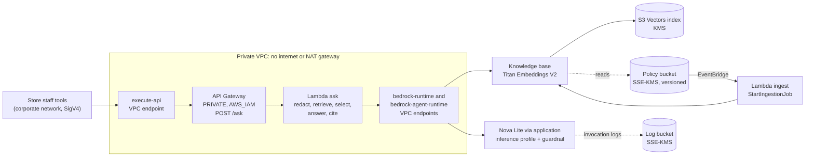

# RAG on Amazon Bedrock: a private policy assistant

A private question-answering API over Harbor Goods' store and supplier policies, built on Amazon Bedrock Knowledge
Bases with Amazon S3 Vectors and a Bedrock guardrail, defined in Terraform and evaluated offline.

[](https://github.com/gamaware/terraform-aws-bedrock-rag-lab/actions/workflows/ci.yml)
[](LICENSE)


> **Lab.** Harbor Goods and all data here are fictional. Each repository in this portfolio is a
> separate engagement with Harbor Goods, a fictional mid-size retailer. Account IDs are AWS documentation examples.

## What this proves

- **Answers that cite or refuse:** `POST /ask` returns an answer, the policy documents it cites and the guardrail's
  verdict. An answer without a valid citation is replaced by a refusal in code, and a question with no relevant
  context is refused before any model call.
- **Measured retrieval:** a 40-question golden set, a chunking comparison and pass thresholds that fail the build on a
  regression, all without an AWS account. The same harness runs against the deployed knowledge base.
- **Guardrails as reviewed data:** one YAML file drives the Bedrock guardrail (denied topics, PII masking and
  blocking, prompt-attack filter, contextual grounding) and the function's PII pre-filter, with tests for both.
- **A cost per question the client can defend:** pinned prices, token counts from the real prompt builder, and a
  comparison of S3 Vectors, OpenSearch Serverless and Aurora pgvector.
- **Private by construction:** a `PRIVATE` REST API with IAM auth behind a VPC endpoint, a function with no route to
  the internet, KMS on every store and log, and IAM scoped to one knowledge base, profile, model and guardrail.
- **Tested without an AWS account:** 139 Python tests, 20 mocked `terraform test` runs, Checkov, Trivy, tflint,
  Semgrep, ruff and mypy behind one `make verify`.

## Inspect the deliverable

| Artifact | Why look |
| --- | --- |
| [`report/REPORT.md`](report/REPORT.md) ([PDF](report/REPORT.pdf)) | Evaluation results, chunking decision, guardrail evidence, cost model, risks |
| [`src/harbor_rag/service.py`](src/harbor_rag/service.py) | Redact, retrieve, select, answer with the guardrail, enforce citations |
| [`config/guardrail.yaml`](config/guardrail.yaml) | The guardrail policy Terraform and the function both read |
| [`data/golden.jsonl`](data/golden.jsonl) and [`data/eval.yaml`](data/eval.yaml) | The questions, the expected documents and facts, the gates |
| [`src/harbor_eval/cost_model.py`](src/harbor_eval/cost_model.py) | Cost per question from [`data/prices.yaml`](data/prices.yaml) |
| [`infra/terraform/`](infra/terraform) | Three stacks and the tests that pin their guarantees |
| [`docs/runbook.md`](docs/runbook.md) | Re-ingest, rotate the model, calibrate selection, investigate a bad answer |

## Scenario and acceptance criteria

Harbor Goods, a fictional mid-size retailer, has a store-support team that answers staff questions about returns,
warranty, shipping and supplier policies by searching about 200 documents by hand. Answers are slow and inconsistent.
Leadership wants an internal assistant that cites its sources, never invents a policy, keeps customer PII out, and has
a cost per question the team can defend.

Constraints: internal use only, no public endpoints, one AWS account and Region, and a platform team that reads
Terraform.

| Acceptance criterion | How it is met | Checked by |
| --- | --- | --- |
| Every answer cites a policy document | Numbered sources, citation mapping, refusal when no valid citation | `tests/test_service.py`, evaluation gates |
| Questions the policies cannot answer are refused | Relevance cut-off before the model, `NO_ANSWER` handling | Gate "refused unanswerable" (6 of 6 offline) |
| Retrieval quality is measured and cannot regress unnoticed | Golden set, recall@5, MRR, citation precision thresholds | `make data-check`, ADR 0004 |
| Customer PII stays out of answers and logs | Guardrail masking and blocking on the question and the answer; local pre-filter before `Retrieve` and on citation excerpts; logs keep a hash, the length and the PII types of the question, never its text | `tests/test_pii.py`, `tests/test_guardrail_policy.py`, `tests/test_handler.py`, `tests/test_service.py` |
| Legal advice, competitor pricing and employee records are declined | Denied topics with examples | Policy tests; red-team set in the live run |
| Nothing is reachable from the internet | Private API, IAM auth, VPC endpoints, no gateways | `terraform test`, live-plan pre-flight |
| Cost per question is known and bounded | Cost model, inference profile tags, budget, reserved concurrency | `tests/test_cost_model.py`, report section 5 |

## Architecture



A question arrives signed with SigV4 through the `execute-api` endpoint. The function redacts PII, calls `Retrieve`,
keeps the chunks that clear the relevance cut-off, and calls `Converse` through an application inference profile with
the guardrail attached; the context is marked as the grounding source and the question as the query the guardrail
screens. It returns the answer with its citations and the
guardrail verdict, and logs a hash of the question (never its text) with token and latency metrics. Uploading a policy document
starts an ingestion job. A CloudWatch dashboard, four alarms, a dead-letter-queue alarm and a monthly budget cover
operations.

Terraform stacks, each with its own state: `data` (buckets, KMS, alerts topic, invocation logging), `knowledge-base`
(S3 Vectors, knowledge base, data source, guardrail, ingestion trigger) and `api` (VPC, endpoints, function, API,
inference profile, dashboard, alarms, budget).

## Verify locally

Prerequisites (versions used to verify this repo):

| Tool | Version |
| --- | --- |
| Python | 3.13 (installed by uv if missing) |
| uv | 0.12 or later |
| Terraform | 1.14.5 |
| tflint | 0.61.0 (AWS ruleset 0.49.0, fetched by `tflint --init`) |
| Checkov | 3.3.19 (run through `uvx`) |
| Trivy | 0.74.0 |
| Semgrep | 1.178 (rules `p/default`, `p/python`, `p/terraform`) |
| shellcheck, shellharden | 0.11, 4.3 |

```bash
uv sync --frozen
make verify
```

The run needs no AWS credentials and makes no AWS API calls. The first run downloads Python packages, Terraform
providers, the tflint ruleset and the Semgrep rules. The run ends with:

```text
verify: all checks passed
```

`make help` lists the targets; `make eval` prints the full evaluation table and `make cost` the cost model.

A real deployment test is available as `make test-live`. It is manual, runs only in the maintainer's sandbox account,
checks every plan for public or untagged resources before applying it, evaluates the deployed stack, and destroys
everything (ADR 0008, [docs/live-test.md](docs/live-test.md)).

## Repository map

```text
config/guardrail.yaml   guardrail policy (Terraform, the function's PII pre-filter and the tests read it)
data/
  corpus/               33 fictional policy documents with Bedrock metadata sidecars
  golden.jsonl          40 questions: relevant documents and expected facts
  eval.yaml             chosen chunking, offline selection settings, gate thresholds
  prices.yaml           pinned unit prices; workload.yaml: volume assumptions
  fixtures/             embedding fixtures, guardrail red-team cases
src/
  harbor_rag/           Lambda code: ask handler, service, prompt, PII pre-filter, Bedrock port, ingest handler
  harbor_eval/          offline retriever, chunking, metrics, evaluation, cost model, report tables
infra/terraform/
  data/                 buckets, KMS, alerts topic, invocation logging (own state)
  knowledge-base/       S3 Vectors, knowledge base, data source, guardrail, ingestion trigger (own state)
  api/                  VPC, endpoints, ask function, private API, profile, dashboard, alarms, budget (own state)
    */tests/            mocked terraform test suites
tests/                  unit tests, Bedrock response fixtures, FakeBedrock
scripts/                live test and its plan pre-flight, report PDF build
report/                 REPORT.md, REPORT.pdf and their hashes
docs/                   ADRs, runbook, live-test guide
.github/workflows/      ci.yml (shared checks + make verify), scorecard.yml
Makefile                one entry point for local and CI runs
```

## Decisions and trade-offs

Architecture decision records follow the *Fundamentals of Software Architecture* (2nd ed.) format.

| Number | Title | Status |
| --- | --- | --- |
| [0001](docs/adr/0001-private-api-with-iam-auth.md) | Private API with IAM authorization, reached through VPC endpoints | Accepted |
| [0002](docs/adr/0002-s3-vectors-over-opensearch-serverless.md) | S3 Vectors over OpenSearch Serverless for the knowledge base | Accepted |
| [0003](docs/adr/0003-retrieve-plus-converse.md) | Retrieve plus Converse instead of RetrieveAndGenerate | Accepted |
| [0004](docs/adr/0004-evaluation-gates.md) | Evaluation gates and their thresholds | Accepted |
| [0005](docs/adr/0005-guardrail-and-pii-prefilter.md) | Guardrail policy as data, with a local PII pre-filter | Accepted |
| [0006](docs/adr/0006-fixed-size-chunking.md) | Fixed-size chunking at 100 tokens | Accepted |
| [0007](docs/adr/0007-model-choice-and-inference-profile.md) | Nova Lite by default, through an application inference profile | Accepted |
| [0008](docs/adr/0008-live-tests-in-a-sandbox-account.md) | Live tests run only in a sandbox account, private-only and tagged | Accepted |

## Security and quality gates

| Gate | Runs in | Why |
| --- | --- | --- |
| pytest (139 tests) | `make test`, CI `verify` job | Service branches with a fake Bedrock port, adapters with botocore `Stubber`, guardrail policy, pre-filter, evaluation, cost model, live pre-flight |
| Evaluation gates | `make data-check`, CI `verify` job | Recall@5, MRR, citation precision, relevant citations, refusals against `data/eval.yaml` |
| Report freshness | `make report-check`, shared `report` workflow | Report tables regenerate from the code; the PDF matches the Markdown |
| ruff, mypy (strict) | `make lint types`, pre-commit | Style, bugs and types in the Lambda and evaluation code |
| Terraform fmt, validate, tflint, `terraform test` | `make tf-verify`, shared `terraform` workflow | Syntax, AWS lint, and the guarantees in the acceptance table |
| Checkov | `make checkov`, shared `security` workflow | Policy checks on Terraform and workflows; skips carry reasons in the code |
| Trivy config | `make trivy`, shared `security` workflow | Misconfigurations |
| Semgrep | `make semgrep`, shared `security` workflow | Static analysis of Python, Terraform and scripts |
| gitleaks, detect-secrets | pre-commit, shared `secrets` workflow | No credentials in the history |
| actionlint, zizmor | pre-commit, shared `lint-actions` workflow | Workflow correctness and hardening |
| OpenSSF Scorecard | `scorecard.yml` | Repository supply-chain posture |

`ci.yml` is a thin caller: the shared checks come from reusable workflows in
[gamaware/.github](https://github.com/gamaware/.github). Workflows start from `permissions: {}`, pin actions by SHA and
set timeouts. Pull request jobs get no cloud access.

## Limits and production adaptations

- **Simulated:** no AWS account backs this repo's CI. Offline retrieval uses hashed-feature embedding fixtures, not
  Titan vectors, and the answer pipeline uses an extractive stand-in model; they gate regressions, and
  `make test-live` measures the deployed stack. Live results are added to the report after the first run.
- **Out of scope:** the staff portal that signs requests, the corporate network connection to the VPC, identity
  federation for staff, and the document management system that uploads policies.
- **A real engagement adds:** the client's real documents and a golden set written with the store-support team,
  per-store or per-role metadata filters, a nightly full sync, human review of low-grounding answers, and an
  evaluation job in the release pipeline for prompt, model and guardrail changes.
- **Cost to run:** about USD 50 a month in fixed costs (three interface endpoints in two zones, KMS, dashboard and
  alarms) plus about USD 1 per 1,000 questions with Nova Lite (report section 5).

## Related work

Part of the [AWS DevOps portfolio](https://github.com/gamaware/aws-devops-portfolio), under the service
[RAG on Amazon Bedrock on Upwork](https://www.upwork.com/freelancers/~014b3520cf9e140103). The pipeline side,
keyless deploy roles and security gates, is covered in
[github-actions-aws-oidc-lab](https://github.com/gamaware/github-actions-aws-oidc-lab).

## Credits

Built on ideas and patterns from these sources, rewritten for this design; no files are copied:

- [Amazon Bedrock Workshop](https://github.com/aws-samples/amazon-bedrock-workshop), module
  `02_Knowledge_Bases_and_RAG` (MIT-0): knowledge base creation, retrieve-and-generate and custom retrieval patterns.
- [amazon-bedrock-rag](https://github.com/aws-samples/amazon-bedrock-rag) (MIT-0): knowledge base, Lambda and API
  reference architecture.
- [sample-bedrock-knowledge-base-terraform](https://github.com/aws-samples/sample-bedrock-knowledge-base-terraform)
  (MIT-0): Terraform wiring for a knowledge base, adapted here from OpenSearch Serverless to S3 Vectors.
- [amazon-bedrock-samples, rag/knowledge-bases](https://github.com/aws-samples/amazon-bedrock-samples/tree/main/rag/knowledge-bases)
  (MIT-0): metadata filtering and RAG evaluation notebooks.
- [Creating Responsible AI With Amazon Bedrock Guardrails](https://catalog.workshops.aws/bedrockguard/en-US) (workshop,
  cited only): guardrail policy design.
- [Deploy Amazon Bedrock Knowledge Bases using Terraform](https://aws.amazon.com/blogs/machine-learning/deploy-amazon-bedrock-knowledge-bases-using-terraform-for-rag-based-generative-ai-applications/)
  (AWS blog, cited only).

## License

[MIT](LICENSE)
